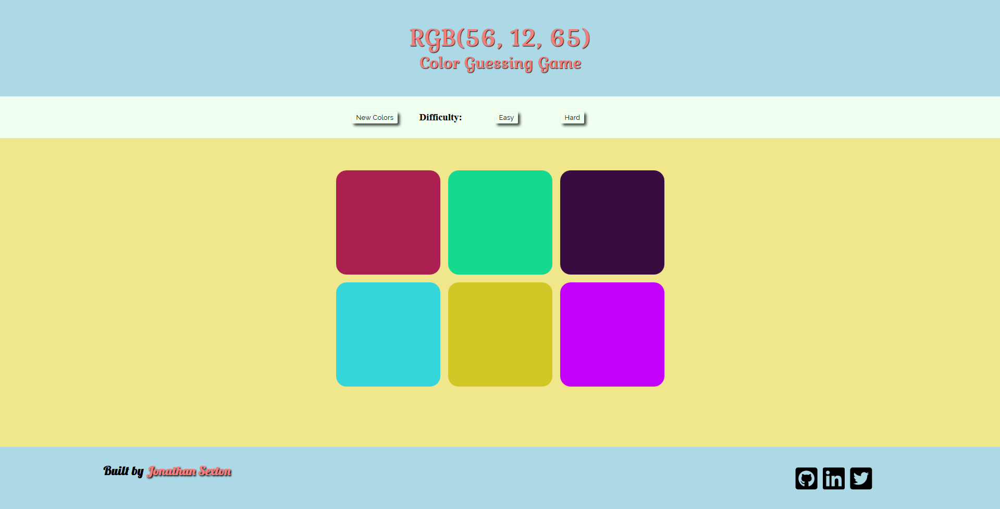

This is an RGB color guessing game I made as part of one of the courses I'm going through.  When the page loads you can start playing or set the mode between "Easy" (only 3 colors to guess from) and "Hard" (6 colors to guess from).  Click the "New Colors/Play Again" button to generate new colors.

Here is a <a href="https://codepen.io/JS-goose/full/deoWme/" target="_blank">working</a> copy if you'd like to play.

